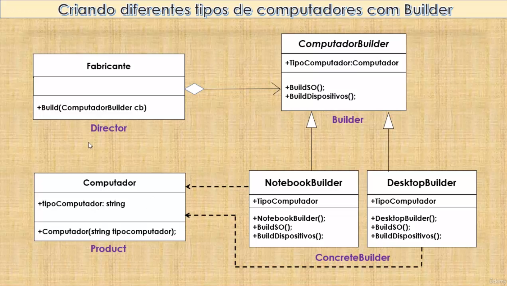

# Builder

Permite a separação da construção de um objeto complexo da sua representação, de modo que o mesmo processo de construção possa criar diferentes representações.

Pode produzir diferentes tipos e representações de um objeto usando o mesmo código de representação - deve ser genérico.

Constrói um objeto complexo usando muitos objetos simples e uma abordagem passo a passo.

