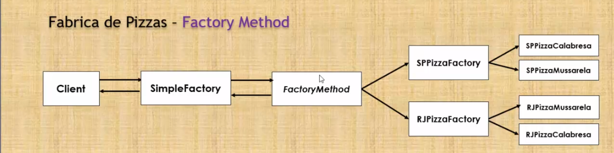

# Factory method

### Intenção 
Definir uma interface p/ criar objetos, permitindo que as subclasses decidam qual classe instanciar.

### Objetivo
Ter diversas classes que implementam a mesma operação, mas que retornam o mesmo tipo abstrato(Pizza). 
E internamente eles instanciam diferentes classes.  
Um Factory method (PizzaFactoryMethod) deve retornar uma classe abstrata ou uma interface (Pizza)

 

O Factory Method permite que uma classe **ADIE A INSTANCIAÇÃO** que ela usa para as subclasses 

    O padrão usa herança e depende de uma subclasse p/ lidar com a instanciação do objeto desejado.

 

Em vez de criar diretamente uma pizza deve-se criar um factory method e delegar às filiais(subclasses) a responsabilidade de criar cada pizza(local).

